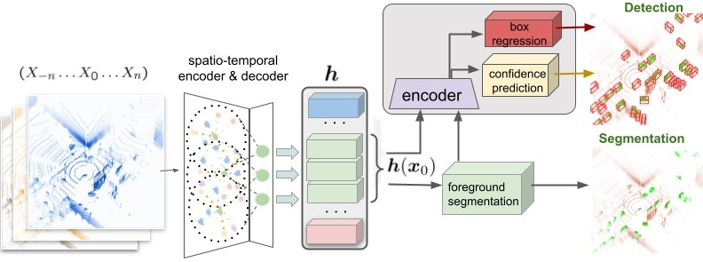

# Back-to-the-Future
ST_PointRCNN -- Modified for argoverse/Custom Dataset


## Installation
### Requirements
All the codes are tested in the following environment:
* Linux (tested on Ubuntu 18/16)
* Python 3.6+
* PyTorch 1.0

### Install PointRCNN 

a. Clone the PointRCNN repository.
```shell
git clone --recursive https://github.com/ctu-vras/Back-to-the-Future.git
```
If you forget to add the `--recursive` parameter, just run the following command to clone the `Pointnet2.PyTorch` submodule.
```shell
git submodule update --init --recursive
```
b. The below conda command will create the conda environment and Install all the dependent python, Cuda libraries like easydict,tqdm, tensorboardX etc.
```
conda env create --file environment1.yml
conda activate pointrcnn1
```
c. Build and install the `pointnet2_lib`, `iou3d`, `roipool3d` libraries by executing the following command:
```shell
sh build_and_install.sh
```


### Dataset preparation
Arrange training logs of argoverse dataset, inside in a single folder. Copy the address of that directory to in yaml file.
NB: Transform the lidar frames from past and future frames into the reference frame coordinate systems in the format of [x,y,z,t], where t denots the time, t=-t in case of past and +t in case of future frame. 

```
# For Argo Dataset         
└── Argo_DATASET_ROOT
       └── training
       			├──lidar
       			├──label
       			└──poses
       └── validation
       			├──lidar
       			├──label
       			└──poses
```
## modify the .yaml file accordiningly

```
CFG.DATA_PATH = '../../data/training' # Change this as per your path
```

```
CFG.VAL_DATA_PATH = '../../data/validation' # Change this as per your path
```

```
CFG.past_frame = 5 # Change this to how many past frames you want to use
```

```
CFG.future_frame = 5 # NB: CFG.future_frame should be 0 for student model, since we are only going to use past frames in the Student model
```

## Teacher model

### Pretrained model
Are available at [Google Drive](https://drive.google.com/drive/folders/1U7DGaADsXt7A3ggvZ4i4xIoi4mKWjTp8?usp=sharing).

#### Quick demo
You could run the following command to evaluate the pretrained model:  First navigate in to "tools/script"
##### To evaluate 3D detection
* run

```
bash run_teacher_test_det_mf1500_w3_p16384_augm_f1_1.sh
```
or

```
python ../eval_rcnn.py --cfg_file ../cfgs/test/test_argo_train_mf1500_w3_p16384_agum_f1_1.yaml --ckpt ../output/teacher/rcnn/argo_train_mf1500_w3_p16384_agum_f1_1/ckpt/best.pth --batch_size 1 --eval_mode rcnn --output_dir ../test/DET/teacher/argo_train_mf1500_w3_p16384_agum_f1_1
```

##### To evaluate Semantic Segmentation
* run
```
bash run_teacher_test_ss_mf1500_w3_p16384_augm_f1_1.sh
```
or

```
python ../eval_rcnn.py --cfg_file ../cfgs/test/test_argo_train_mf1500_w3_p16384_agum_f1_1.yaml --ckpt ../output/teacher/rpn/argo_train_mf1500_w3_p16384_agum_f1_1/ckpt/best.pth --batch_size 1 --eval_mode rpn --output_dir ../test/SS/teacher/argo_train_mf1500_w3_p16384_agum_f1_1
```


### Training

#### Training of RPN stage
* To train the first proposal generation stage of PointRCNN with a single GPU, run the following command: 
First navigate in to Teacher/tools/script

```
python ../train_rcnn.py --cfg_file ../cfgs/teacher/argo_train_mf1500_w3_p16384_agum_f1_1.yaml --batch_size 16 --train_mode rpn --epochs 200 --output ../output/teacher/rpn/argo_train_mf1500_w3_p16384_agum_f1_1
```

* To use **mutiple GPUs for training**, simply add the `--mgpus` argument as follows:
```
CUDA_VISIBLE_DEVICES=0 python ../train_rcnn.py --cfg_file ../cfgs/teacher/argo_train_mf1500_w3_p16384_agum_f1_1.yaml --batch_size 16 --train_mode rpn --epochs 200 --output ../output/teacher/rpn/argo_train_mf1500_w3_p16384_agum_f1_1 --mgpus
```

After training, the checkpoints and training logs will be saved to the corresponding directory according to the name of your configuration file. Such as for the `argo_train_mf1500_w3_p16384_agum_f1_1.yaml`, you could find the checkpoints and logs in the following directory:

```
tools/output/teacher/rpn/argo_train_mf1500_w3_p16384_agum_f1_1/
```
which will be used for the training of RCNN stage. 

#### Training of RCNN stage
Suppose you have a well-trained RPN model saved at `output/teacher/rpn/argo_train_mf1500_w3_p16384_agum_f1_1/ckpt/checkpoint_epoch_200.pth`, 

```
python ../train_rcnn.py --cfg_file ../cfgs/teacher/argo_train_mf1500_w3_p16384_agum_f1_1.yaml --batch_size 16 --train_mode rcnn --epochs 70 --ckpt_save_interval 1 --rpn_ckpt ../output/teacher/rpn/argo_train_mf1500_w3_p16384_agum_f1_1/ckpt/best.pth --output ../output/teacher/rcnn/argo_train_mf1500_w3_p16384_agum_f1_1

```
* Once the model is fully trained 
### Inference to generate Pseudo labels
* To evaluate a single checkpoint, run the following command with `--ckpt` to specify the checkpoint to be evaluated:
```
python ../eval_rcnn.py --cfg_file ../cfgs/test/test_argo_train_mf1500_w3_p16384_agum_f1_1.yaml --ckpt ../output/teacher/rcnn/argo_train_mf1500_w3_p16384_agum_f1_1/ckpt/best.pth --batch_size 1 --eval_mode rcnn --output_dir ../test/DET/teacher/argo_train_mf1500_w3_p16384_agum_f1_1
```

* To generate the results on the *test* split, please modify the `TEST.SPLIT=TEST` and add the `--test` argument. 
#### Teacher Concordance
* To geberate pseudo labels using concordance of teacher run:
```
cd Concordance
python generate_teacher_concordance.py --prediction_path /mnt/data/test/argo_config_test_mf_1500_w3_p16384_agum_f4_4/label --label_path /mnt/data/test/argo_config_test_mf_after_1500_w3_p16384_agum_f5_5/label --iou 0.01 --lamda 0.1 --pcmin 0 --pcmax 100 --output Concordance_T4_4_T5_5_lamda_01/label
```

## STUDENT Model

### Dataset preparation
Arrange all training logs of argo dataset, inside in a single folder. Copy the address of that directory to in .yaml file.
NB: Transform the lidar frames from past and future into the reference frame coordinate frames in the format of `[x,y,z,t]`, where t denots the time, `t=-t in case of past and +t in case of future frame`. 
NB: Also add the the pseudo labelled data into the labeld datasets as described above.

### Training

#### Training of RPN stage
* To train the first proposal generation stage of PointRCNN with a single GPU, run the following command: 
First navigate in to /tools/script

```
python ../train_rcnn.py --cfg_file ../cfgs/argo_train_mf1500_w3_p16384_agum_f1_0_T1_1.yaml --batch_size 16 --train_mode rpn --epochs 200
```

* To use **mutiple GPUs for training**, simply add the `--mgpus` argument as follows:
```
CUDA_VISIBLE_DEVICES=0,1,.. python ../train_rcnn.py --cfg_file ../cfgs/argo_train_mf1500_w3_p16384_agum_f1_0_T1_1.yaml --batch_size 16 --train_mode rpn --epochs 200 --mgpus
```

After training, the checkpoints and training logs will be saved to the corresponding directory according to the name of your configuration file. Such as for the `argo_train_mf1500_w3_p16384_agum_f1_0_T1_1.yaml`, you could find the checkpoints and logs in the following directory:

```
tools/output/student/rpn/argo_train_mf1500_w3_p16384_agum_f1_0_T1_1/
```
which will be used for the training of RCNN stage. 

#### Training of RCNN stage
Suppose you have a well-trained RPN model saved at `output/rpn/argo_train_mf1500_w3_p16384_agum_f1_0_T1_1/ckpt/best.pth`, 

```
python ../train_rcnn.py --cfg_file ../cfgs/student/argo_train_mf1500_w3_p16384_agum_f1_0_T1_1.yaml --batch_size 16 --train_mode rcnn --epochs 70 --ckpt_save_interval 1 --rpn_ckpt ../output/student/rpn/argo_train_mf1500_w3_p16384_agum_f1_0_T1_1/ckpt/best.pth --output ../output/student/rpn/argo_train_mf1500_w3_p16384_agum_f1_0_T1_1

```
* Once the model is fully trained 
### Testing
* To evaluate a the best checkpoint, run the following command with `--ckpt` to specify the checkpoint to be evaluated:
```
python ../eval_rcnn.py --cfg_file ../cfgs/test/test_argo_train_mf1500_w3_p16384_agum_f1_0_T1_1.yaml --ckpt ../output/student/rcnn/argo_train_mf1500_w3_p16384_agum_f1_0_T1_1/ckpt/best.pth --batch_size 1 --eval_mode rcnn --output ../output/student/rcnn/argo_train_mf1500_w3_p16384_agum_f1_0_T1_1
```

### Ongoing Work.

